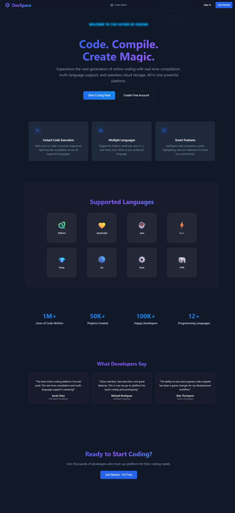
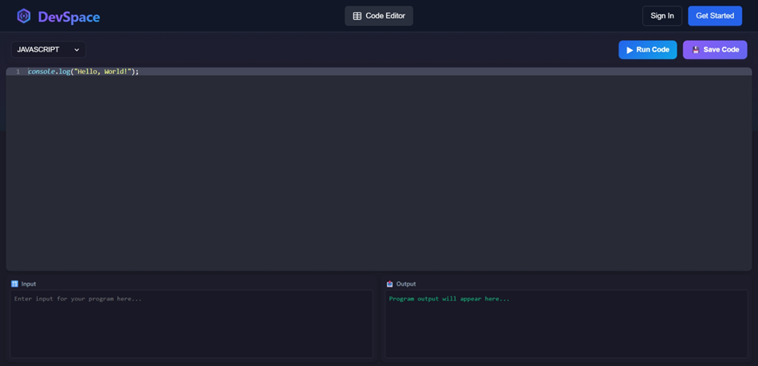
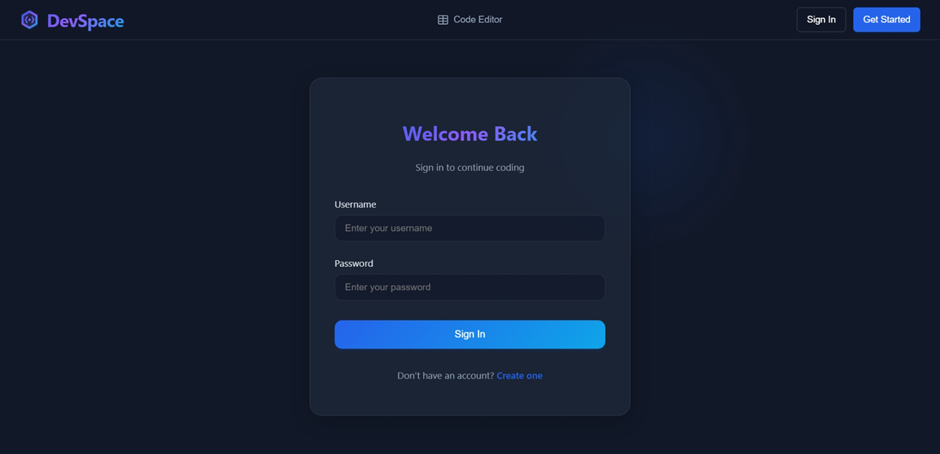
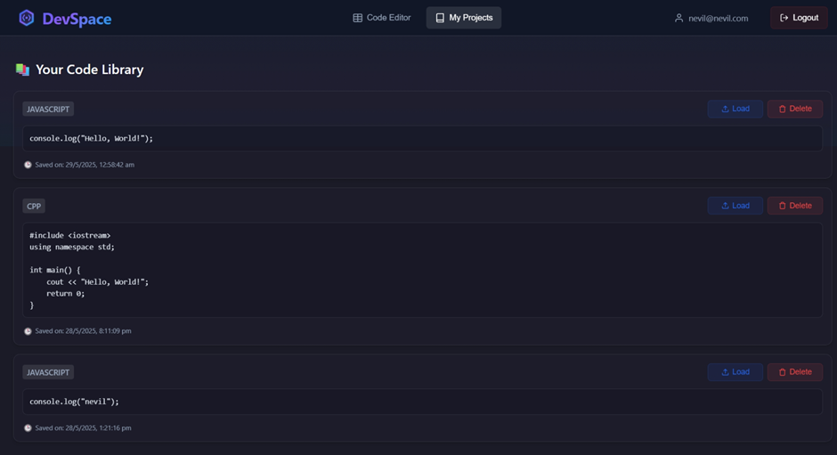

# 🚀 DevSpace — Online Code Editor 

**DevSpace** is a powerful, web-based code editor built using the **MERN stack (MongoDB, Express.js, React.js, Node.js)**. It allows users to **write, compile, and save code**, with full authentication (login/logout), syntax highlighting, and support for multiple languages using the **Judge0 API**.

---

## 🌟 Features

- ⚡ Real-time code compilation (via Judge0 API)
- 🔐 User Authentication (Register / Login / Logout)
- 🧠 Code Editor with syntax highlighting (Monaco & Ace Editor)
- 💾 Save and retrieve code snippets from MongoDB
- 🔄 RESTful API with Express and JWT-based auth
- 📦 Clean and responsive React frontend

---

## 🗂️ Project Structure

```
DevSpace/
├── assets/
├── code-compiler-frontend/     # React frontend (UI and code editor)
└── code-compiler-backend/      # Node.js + Express backend (API, Auth, DB)
```

---

## 🛠️ Installation & Setup

### ✅ Backend Setup (`code-compiler-backend`)

1. Navigate to the backend folder:

   ```bash
   cd code-compiler-backend
   ```

2. Install dependencies:

   ```bash
   npm install
   ```

3. Create a `.env` file in the backend folder and add:

   ```env
   JUDGE0_API_KEY=your_judge0_api_key
   PORT=5000
   MONGODB_URI=your_mongodb_connection_string
   JWT_SECRET=your_secret_key
   ```

4. Start the backend server:

   ```bash
   npm start
   ```

---

### 💻 Frontend Setup (`code-compiler-frontend`)

1. Navigate to the frontend folder:

   ```bash
   cd code-compiler-frontend
   ```

2. Install dependencies:

   ```bash
   npm install
   ```

3. Start the React dev server:

   ```bash
   npm start
   ```

---

## 🌐 Accessing DevSpace

Once both servers are running:

- **Frontend:** [http://localhost:3000](http://localhost:3000)
- **Backend:** [http://localhost:5000](http://localhost:5000)

> 💡 Ensure that the frontend is properly connected to the backend API.

---

## ⚙️ Technologies Used

| Layer        | Stack / Tool                            |
|--------------|------------------------------------------|
| Frontend     | React.js, Axios, Monaco Editor, Ace Editor |
| Backend      | Node.js, Express.js                     |
| Database     | MongoDB (Mongoose ORM)                  |
| Authentication | JWT, bcrypt                          |
| Code Execution | Judge0 API                            |

---

## 📜 Scripts

### Backend

```bash
npm start     # Run the backend server
npm run dev   # Run with nodemon for live reload
```

### Frontend

```bash
npm start     # Run the React dev server
npm run build # Build for production
npm test      # Run tests
```

---

## 🔐 Environment Variables

Create a `.env` file in the backend folder with:

```env
JUDGE0_API_KEY=your_judge0_api_key
PORT=5000
MONGODB_URI=your_mongo_db_connection_string
JWT_SECRET=your_jwt_secret_key
```

---

## 📸 Screenshots 

Here are some screenshots showcasing the features and UI of **DevSpace**:

### 🚀 Landing Page


### 💻 Code Editor


### 🔐 Login Page


### 🗃️ Saved Code Library

---
